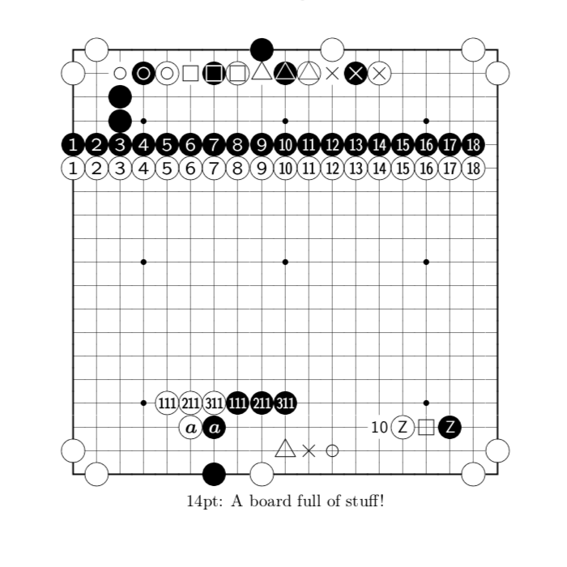
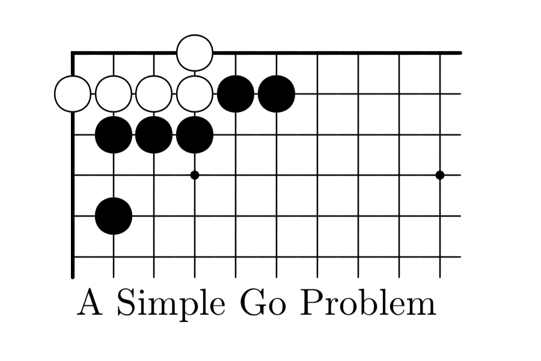

# Go-Type1: Go Postscript Type1 Fonts for LaTeX


Go-type1 contains vector-graphics fonts for creating professional-quality books
for the board game <a
href="https://en.wikipedia.org/wiki/Go_(game)">Go</a>, also known as Igo
(囲碁), Baduk (바둑), Weiqi (围棋), for use in [LaTeX typesetting
system](https://www.latex-project.org/). The fonts are all provided as **PostScript
Type1** fonts rather than rasterized (bitmap) fonts, and so provide high
resolutions for e-books and print books.

## Table of Contents

* [Overview](#overview)
* [Recommendations](#recommendations)
* [Installation](#installation)
* [Examples](#examples)
  * [Gnos Examples](#gnos-examples)
  * [Gooe Examples](#gooe-examples)
  * [Igo Examples](#igo-examples)
* [Using Gnos in LaTeX](#using-gnos-in-latex)
  * [The LaTeX Structure](#the-latex-structure)
  * [Gnos Tips](#gnos-tips)
  * [Writing a Book](#writing-a-book)
* [Font Deep Dive](#deep-dive)
  * [What's Here](#whats-here)
  * [Tex and Tex Distributions](#tex-and-tex-distributions)
  * [Long Installation Steps](#long-installation-steps)
  * [Converting METAFONT to Type1](#converting-metafont-to-type1)
* [Resources](#resources)

## Overview

In summary, this repository contains TeX font information for four fonts:

*   **Gnos (Recommended)**: My modification of the Gooe font series, which makes the
    border-lines a bolder, the star points bigger, and makes it easier to use
    in scripts. This font was used by GoGameGuru's book
    [*Relentless*](https://www.amazon.com/Relentless-Lee-Sedol-Gu-Li/dp/0981912184).
*   **Igo**: A font created in 1991 by Hanna Kolodziejska and modified by
    Etienne Dupuis and others, that evokes the style of the old Ishi press and
    Kiseido books.
*   **Gooe**: A font created by Dan Bump and popularized by Reid Augustin's
    [sgf2dg script](http://search.cpan.org/~reid/Games-Go-Sgf2Dg-4.252/) for
    creating go books. See also the [Sensei's library
    article](http://senseis.xmp.net/?Sgf2dg) for more details about usage and
    history. *Note:* While this repo contains the fonts, it does not contain
    the sgf2dg script or related content.
*   **Jigo**: (Experimental) My attempt at modifying the Igo font series to
    allow the fonts to be used directly in scripts. This is a work in progress
    and not currently installed by the installer.

**Note**: This repository, Go-Type1, was original created by Kashomon in 2014
but was moved to the [*Otrego*
Organization](https://github.com/otrego/community) in 2020.

All of these fonts are available as Postscript Type 1 fonts, which is an old
vector graphic font standard that can be used with LaTeX.

This work derives from [Vit Brunner (tasuki)](https://github.com/tasuki) who
created a series of tsumego books using the Type1 Gooe font. Later, this work
was helped tremendously by the existence of [Nyamcoder's
instructions](https://github.com/nyamcoder/tex-src/blob/master/baduk/baduk.tex)
for installing the Type1 Igo font. Ultimately, these fonts exist to be used in
[GPub](https://www.github.com/Kashomon/gpub), a Javascript library I (Kashomon)
created for generating Go books.

These packages are designed to work with LaTeX, but there's no reason it
shouldn't work with a LaTeX compatible compiler like XeTeX.

## Recommendations

If you're here trying to decide what fonts to use in generating Go books then
here are my **recommendations**:

1.  If you are planning on creating or using scripts to generate your books:
    1.  Gnos (**Recommended**): Fully featured; Looks great in print form.
    1.  Gooe: Fully featured, has a less bold-look than Gnos.

1.  If you are manually creating diagrams yourself only using LaTeX:
    1.  Igo: Igo is meant for users creating diagrams manually at LaTeX, and is
        much terser than Gnos or Gooe.  However, it comes at the cost of having
        fewer glyphs, being slow to compile, and having incompatibilities
        with other LaTeX packages.

## Installation

On OSX, and Linux the easiest way to install is to use the installer script:

```shell
# Install gooe, gnos, igo
go-type1/installer.sh install all

# Install just gnos
go-type1/installer.sh install gnos
```

## Examples

You can findthese examples in [examples/full_comparison.tex](examples/full_comparison.tex) and the rendered [examples/full_comparison.pdf](examples/full_comparison.pdf)

### Gnos Examples

As mentioned, Gnos is the recommend font. Here's a simple Tsumego problem using.
the Gnos font:

```latex
\begin{center}
{\gnos%
<((!((((((\\
!!!!@@++++\\
\char91\char64@@++++++\\
\char91\char43\char43\char42+++++*\\
\char91@++++++++\\
\char91+++++++++\\
}
A Simple Go Problem!
\end{center}
```


Here's a demo of all the symbols supported by Gnos:

```latex
{
\gnosfontsize{14}
{
\gnos%
<!((((((@((!(((((!>\\
!+1Cc2Ss3Tt4Xx++++!\\
\char91+@+++++++++++++++]\\
\char91+@*+++++*+++++*++]\\}
{\gnosb\char1\char2\char3\char4\char5\char6\char7\char8\char9\char10\char11\char12\char13\char14\char15\char16\char17\char18}{\gnos]\\}
{\gnosw\char1\char2\char3\char4\char5\char6\char7\char8\char9\char10\char11\char12\char13\char14\char15\char16\char17\char18}{\gnos]\\
\char91+++++++++++++++++]\\
\char91+++++++++++++++++]\\
\char91+++++++++++++++++]\\
\char91++*+++++*+++++*++]\\
\char91+++++++++++++++++]\\
\char91+++++++++++++++++]\\
\char91+++++++++++++++++]\\
\char91+++++++++++++++++]\\
\char91+++++++++++++++++]\\
\char91++*{\gnoswi\char11}{\gnoswii\char11}{\gnoswiii\char11}{\gnosbi\char11}{\gnosbii\char11}{\gnosbiii\char11}+++++*++]\\
\char91++++{\gnoswl\char1}{\gnosbl\char1}++++++\gnosEmptyLbl{\sffamily{10}}\gnosOverlap{!}{Z}\gnosOverlap{+}{\gnos 2}\gnosOverlap{@}{\color{white}Z}+]\\
!++++++++\gnosOverlap{+}{\gnos 3}\gnosOverlap{+}{\gnos 4}\gnosOverlap{+}{\gnos 1}++++++!\\
,!))))@)!))))))))!.\\
}}
14pt: A board full of stuff!
```



### Gooe Examples
Here's an example of a simple problem using the Gooe font.

```latex
\begin{center}
{\goo
\0??<\0??(\0??(\- !(\0??(\0??(\0??(\0??(\0??(\0??(
\- 

### Igo Examples
Here's the same problem with the Igo font.

```latex
\white{a18,b18,c18,d18,d19}
\black{b17,c17,d17,e18,f18,b15}
\begin{center}
\shortstack{\showgoban[a14,k19]\\ A Simple Go Problem}
\end{center}
```



## Using Gnos in LaTeX

This section will walk you through how to get started with Gnos in LaTeX.

```latex
\usepackage[T1]{fontenc}
```

Then, LaTeX should be able use the new Type1 fonts.

See the example below for more information. Ther are also more exmaple TeX files
in the examples/ directory.

### The LaTeX structure
LaTeX starts with some header declarations, followed by begin document, content,
and lastly, ending the document.

```latex
\documentclass{article}
\usepackage{gnos} % or igo, gooemacs
\usepackage[T1]{fontenc}

\begin{document}

% Content goes here

\end{document}
```

### Gnos Tips

Gnos fonts suffer from wrapping problems: it's very easy to get the fonts
misaligned and end up with bad-looking diagrams. The easiest solution is to
wrap your diagrams in a LaTeX minipage, which is how the diagram at the top of
the page was created:

```latex
\begin{center}
\section*{Go Type-1 Fonts}
\vspace{12pt}
\begin{minipage}[t]{240pt}
\gnosfontsize{12}
{\gnos%
<(((((((((((((((((>\\
\char91+++++++++++@\gnosOverlap{@}{\color{white}\footnotesize{45}}\gnosOverlap{@}{\color{white}\footnotesize{47}}+++]\\
\char91++!+@+++!@@!!\gnosOverlap{!}{\footnotesize{46}}!@+]\\
\char91++*!@+!+!@!++@*@+]\\
\char91+@+!@+@+@!!++++++]\\
\char91+++!!@@+@++++++++]\\
\char91+++++!+++++++++++]\\
\char91+@+++++++++++++++]\\
\char91+++++++++++++++!+]\\
\char91++*+++++*+++++*++]\\
\char91+++++++++++++++++]\\
\char91+++++++++++++++++]\\
\char91++++++++++++++!++]\\
\char91+!+++++++++++@!!+]\\
\char91++++++++++++++!@+]\\
\char91++*+++++*++++@*@+]\\
\char91++!+++++++++++@++]\\
\char91+++++++++++++++++]\\
,))))))))))))))))).\\
}
\centerline{\textit{\textbf{Diagram 23}}}
\subtext{(Moves: 45-47)}
\end{minipage}
\end{center}
```


### Writing a Book

Making a professional-quality book with LaTeX takes quite a bit more work than
just creating diagrams. In general, professional-grade books need to be
[PDF/X-1a:2001](https://en.wikipedia.org/wiki/PDF/X) compatible, which imposes
several technical requirements on the construction of PDF documents.
Additionally, you will want to refine the look and feel of the frontmatter,
page layout, and page size.

I highly recommend taking a look at:

* [The Memior class for LaTeX](https://ctan.org/pkg/memoir?lang=en), which has
  an extensive
  [manual](http://tug.ctan.org/tex-archive/macros/latex/contrib/memoir/memman.pdf).
* [The MemDesign guide](https://ctan.org/pkg/memdesign), which takes a deeper
  look at the practice of making books.

You can see a prototype used for
[Relentless](https://www.amazon.com/Relentless-Lee-Sedol-Gu-Li/dp/0981912184)
in book-example/ that was created with
[GPub](https://github.com/Kashomon/gpub).

* [Raw SGF Source](book-example/Fujisawa-Hosai-vs-Go-Seigen-19430225-commentary-An-Younggil-8p.sgf)
* [game\_commentary.tex: Raw source](book-example/game_commentary.tex)
* [game\_commentary.pdf: PDF Output](book-example/game_commentary.pdf)

## Font Deep Dive

If are interested in the nitty-gritty details of the fonts or you want to make
your own modifications, this section should provide some helpful background.

### What's here

There are four directories containing font files:

```
gnos-fonts/
gooe-fonts/
igo-fonts/
jigo-fonts/ (Experimental)
```

In each of these, there are 4 types of files of interest:

  - *.pfb* : these are the Type1 font definitions
  - *.tfm* : the LaTeX font metric files.
  - *.map* : the mapping-declaration files that tell latex how to associate the
    fonts with names
  - *.sty* : Tex macro files that make it easier to work with the font

### Tex and Tex Distributions

Installation of these fonts relies heavily on your particular distribution of
TeX.  You'll be installing the font files in TEXMFHOME location.  Assuming
you've installed TeX, you can find the location of your TEX directories with:

```shell
kpsewhich -expand-var "\$TEXMFHOME"
```

or

```shell
$(kpsewhich -var-value TEXMFHOME)
```

### Long Installation Steps
This is not recommended for most users, but this is a record of what I did
install the fonts by hand initially if you get stuck.

```shell
cd go-type1
texhome=$(kpsewhich -var-value TEXMFHOME)
echo $texhome   # Should be non empty
mkdir -p $texhome/tex/latex/gooe
mkdir -p $texhome/fonts/map/dvips/gooe
mkdir -p $texhome/fonts/type1/gooe
mkdir -p $texhome/fonts/tfm/gooe
cp gooe-fonts/gooemacs.sty $texhome/tex/latex/gooe
cp gooe-fonts/gooe.map $texhome/fonts/map/dvips/gooe
cp gooe-fonts/*.pfb $texhome/fonts/type1/gooe
cp gooe-fonts/*.tfm $texhome/fonts/tfm/gooe
texhash $texhome
updmap --enable Map=gooe.map
```

### Converting METAFONT to Type1
Converting from METAFONT to Type1 fonts can be a challenge. Here's what I did,
mostly a record for myself, but it might be useful for you too.

First, some setup:

  * Update homebrew (OSX package manager)
  * Download mftrace
  * Install `autoconf` via homebrew (`brew install autoconf`)
  * Run `autoconf` on `mftrace`'s `autogen.sh`
  * `brew install potrace` -- font tracing program
  * `brew install fontforge`
  * Go back to `mftrace` and run `./configure` and `make install`

To convert `METAFONT` to Type1, run:

```shell
mftrace --formats=PFB myfile.mf
```

To regenerate the TFM files, run:

```shell
mktextfm myfile.mf
```

## Resources

For more details on all of this, see:

  - [Tasuki's Tsumego Repo](https://github.com/tasuki/tsumego)
  - [sgf2dg on CPAN](http://search.cpan.org/~reid/Games-Go-Sgf2Dg-4.211/sgf2dg)
  - [Font Intallation Guide](
    http://www.ctan.org/tex-archive/info/Type1fonts/fontinstallationguide/)
  - [fontinst guide](
    http://www.ctan.org/tex-archive/fonts/utilities/fontinst/doc/manual/)
  - [Font Tutorial](
    http://www.tug.org/mactex/fonts/fonttutorial-current.html)
  - [Discussion on LaTeX font installation I found useful](
    http://macosx-tex.576846.n2.nabble.com/font-install-July-6-td611560.html)
  - [Converting METAFONT to type 1](
    http://www.ntg.nl/eurotex/szabo.pdf)
  - [Nyamcoder's Baduk work with Igo](https://github.com/nyamcoder/tex-src/blob/master/baduk/baduk.tex)

